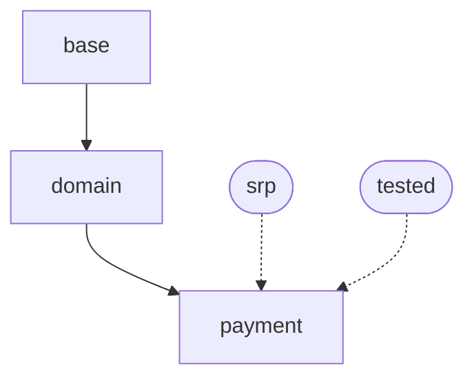

# CLI: Discovery Commands

Commands for finding and exploring architectures.

**Commands covered:** `discover`, `decide`, `resolve`, `diff-arch`, `schema`, `graph`

---

## `archcodex discover <query>`

Find matching architecture for natural language intent.

```bash
archcodex discover "payment processor for refunds"

# Auto-sync index if stale (after registry changes)
archcodex discover "payment processor" --auto-sync

# List all available architectures
archcodex discover --list

# Limit results
archcodex discover "payment" --limit 3
```

### Output

```
Found 1 matching architecture:

1. domain.payment.processor (score: 0.92)
   Transaction processors for payment operations
   Template: template://processor.ts

Use: archcodex scaffold domain.payment.processor --name RefundProcessor
```

### Auto-Sync

After modifying `.arch/registry/`, the discovery index may become stale. Enable automatic sync:

```yaml
# .arch/config.yaml
discovery:
  auto_sync: true
```

Or use the `--auto-sync` flag for individual commands.

---

## `archcodex decide`

Interactive decision tree for guided architecture selection. Walks through yes/no questions to find the right architecture.

```bash
# Interactive mode - answers questions to find architecture
archcodex decide

# Show the full decision tree structure
archcodex decide --show-tree

# Output result as JSON
archcodex decide --json
```

### Options

| Option | Description |
|--------|-------------|
| `--show-tree` | Display the full decision tree structure |
| `--json` | Output final result as JSON |

### Decision Tree File

Create `.arch/decision-tree.yaml` to define your project's decision tree:

```yaml
version: "1.0"
description: "Architecture selection guide"
start: q1

nodes:
  q1:
    type: question
    text: "Is this USER-CREATED CONTENT the user can edit/delete?"
    examples: "products, orders, articles, categories"
    yes: r_resource
    no: q2

  q2:
    type: question
    text: "Is this IDENTITY/ACCOUNT data?"
    examples: "profiles, users, account settings"
    yes: r_identity
    no: q3

  q3:
    type: question
    text: "Is this a CLI command handler?"
    yes: r_cli
    no: r_util

  r_resource:
    type: result
    arch_id: domain.resource.query
    why: "soft delete, permissions, audit"

  r_identity:
    type: result
    arch_id: domain.identity.query
    why: "no soft delete, account-level lifecycle"

  r_cli:
    type: result
    arch_id: cli.command
    why: "CLI commands follow the command pattern"

  r_util:
    type: result
    arch_id: util
    why: "Utility functions should be pure"
```

### Sample Output

```
Architecture Decision Tree

Q1: Is this USER-CREATED CONTENT the user can edit/delete?
    Examples: products, orders, articles, categories
    [y/n]: n

Q2: Is this IDENTITY/ACCOUNT data?
    Examples: profiles, users, account settings
    [y/n]: n

Q3: Is this a CLI command handler?
    [y/n]: y

Decision Path:

├─ Is this USER-CREATED CONTENT the user can edit/delete?
│   → NO
├─ Is this IDENTITY/ACCOUNT data?
│   → NO
└─ Is this a CLI command handler?
    → YES

Recommended Architecture:

  cli.command
  CLI commands follow the command pattern

Use: archcodex scaffold cli.command --name <ClassName>
```

---

## `archcodex resolve <arch_id>`

Debug: show flattened rules for an architecture.

```bash
archcodex resolve domain.payment.processor

# JSON output
archcodex resolve domain.payment.processor --json
```

### Options

| Option | Description |
|--------|-------------|
| `--json` | Output as JSON |
| `-c, --config <path>` | Path to config file (default: `.arch/config.yaml`) |

Shows:
- Inheritance chain
- Applied mixins
- All constraints (flattened)
- Hints and pointers

---

## `archcodex diff-arch <from> <to>`

Compare two architectures to see constraint differences. Useful before switching `@arch` tags.

```bash
# Compare what changes when switching architectures
archcodex diff-arch archcodex.core.engine archcodex.cli.command

# JSON output for programmatic use
archcodex diff-arch archcodex.util archcodex.core.engine --json
```

### Output

```
════════════════════════════════════════════════════════════
ARCHITECTURE DIFF: archcodex.util → archcodex.core.engine
════════════════════════════════════════════════════════════

CONSTRAINTS

  + NEW REQUIREMENTS (you will need to satisfy these):
    [ERROR] forbid_import: commander, chalk, ora
         Core must not depend on CLI/presentation concerns
    [WARN] max_public_methods: 10
         Engines should have focused public API

  - REMOVED (no longer required):
    forbid_import: fs, path
    max_file_lines: 200

MIXINS

  + Added: srp, dip, tested
  - Removed: dry, pure

SUMMARY
  Switching from archcodex.util to archcodex.core.engine:
    5 new constraint(s) to satisfy
    3 constraint(s) no longer apply
```

### Use Cases

- Preview constraint changes before modifying `@arch` tags
- Understand why violations appeared after changing architecture
- Compare architectures when deciding which to use

---

## `archcodex schema`

Discover available options when creating or updating architectures. Optimized for LLM agents with minimal default output.

```bash
# Default: minimal list of rule names (agent-optimized)
archcodex schema

# Query specific rule - get focused info
archcodex schema forbid_import
archcodex schema require_pattern

# Show complete working examples (recommended for learning)
archcodex schema --examples              # List example categories
archcodex schema --examples all          # Show all examples
archcodex schema --examples constraints  # Show constraint examples
archcodex schema --examples naming_pattern  # Show specific example

# Show common pattern recipes
archcodex schema --recipe domain-service
archcodex schema --recipe repository
archcodex schema --recipe controller

# Show scaffold-able architecture template
archcodex schema --template

# AI format: ultra-minimal, copy-paste ready YAML
archcodex schema --format ai
archcodex schema forbid_import --format ai

# Comprehensive output (all rules, fields, conditions)
archcodex schema --all

# Show architecture and constraint fields
archcodex schema --fields

# Show condition types for "when" clauses
archcodex schema --conditions

# Show available mixins from registry
archcodex schema --mixins

# Show available architectures for inheritance
archcodex schema --architectures

# JSON output for programmatic use
archcodex schema --json
```

### Options

| Option | Description |
|--------|-------------|
| `<rule>` | Query specific rule (e.g., `schema forbid_import`) |
| `--examples [category]` | Show complete working examples (architectures, constraints, recipes, or all) |
| `--recipe <name>` | Show recipe for common pattern (domain-service, repository, controller, etc.) |
| `--template` | Show scaffold-able architecture template |
| `--format ai` | Ultra-minimal YAML format for copy-paste |
| `--all` | Show comprehensive output (old default behavior) |
| `--rules` | Show constraint rules with descriptions and examples |
| `--fields` | Show architecture node and constraint fields |
| `--conditions` | Show condition types for `when` clauses |
| `--mixins` | Show available mixins from current registry |
| `--architectures` | Show architectures available for inheritance |
| `--json` | Output as JSON |

### Default Output (Minimal)

```
RULES: forbid_import, require_import, allow_import, forbid_pattern, ...

Query specific: schema <rule|field|condition>
Comprehensive:  schema --all
Examples:       schema --examples
Recipes:        schema --recipe <name>
AI format:      schema --format ai
```

### Query Specific Rule

```bash
$ archcodex schema forbid_pattern

forbid_pattern
  Block regex pattern in content
  Param: pattern: regex
  Example: pattern: console\\.log

  Fields: pattern, applies_when, unless, severity, why, alternative
```

### AI Format (--format ai)

```yaml
# forbid_pattern - Block regex pattern
- rule: forbid_pattern
  pattern: 'your_pattern_here'
  severity: error
  why: "Explanation"
```

### Examples (--examples)

Show complete, working examples to help understand how to create architectures:

```bash
$ archcodex schema --examples

Available Example Categories

architectures - Complete architecture definition examples
  Usage: schema --examples architectures
  Items: basic, with_inheritance, with_constraints, with_mixins, with_advanced_fields, with_code_pattern

constraints - Constraint rule usage examples
  Usage: schema --examples constraints
  Items: naming_pattern, forbid_import, require_import, require_pattern, ...

recipes - Common architectural pattern recipes
  Usage: schema --examples recipes
  Items: domain-service, repository, controller, mixin-creation, cli-command, ...
```

### Recipes (--recipe)

Show detailed recipes for common architectural patterns:

```bash
$ archcodex schema --recipe domain-service

Domain Service
Usage: schema --recipe domain-service

# Recipe: Domain Service
# Business logic service following DDD principles

myproject.domain.service:
  inherits: myproject.domain
  description: Domain service for business operations
  rationale: |
    Services orchestrate business logic that doesn't belong to a single entity.
    Use for: Cross-entity operations, complex business rules, use cases.
    Don't use for: Infrastructure concerns, HTTP handling, data access.
  ...
```

Available recipes: `domain-service`, `repository`, `controller`, `mixin-creation`, `cli-command`, `conditional-constraints`

### Template (--template)

Show a scaffold-able architecture template:

```bash
$ archcodex schema --template

Architecture Template
Copy and customize this template for new architectures:

myproject.layer.component:
  inherits: myproject.layer
  description: Component description
  rationale: |
    Use for: ...
    Don't use for: ...
  mixins: []
  constraints: []
  hints: []
  ...
```

---

## `archcodex graph`

Visualize architecture hierarchy and relationships.

```bash
# Mermaid diagram (default)
archcodex graph

# Graphviz DOT format
archcodex graph --format graphviz

# JSON format
archcodex graph --format json

# Show file counts per architecture
archcodex graph --show-files

# Hide mixin relationships
archcodex graph --no-show-mixins

# Filter to specific subtree
archcodex graph --root domain.payment
```

### Options

| Option | Description |
|--------|-------------|
| `-f, --format <fmt>` | Output format: `mermaid` (default), `graphviz`, `json` |
| `--show-files` | Include file counts per architecture |
| `--no-show-mixins` | Hide mixin relationships for cleaner output |
| `--root <arch_id>` | Filter to specific subtree |
| `--max-depth <n>` | Maximum depth to traverse |
| `-c, --config <path>` | Path to config file (default: `.arch/config.yaml`) |

### Output (Mermaid)



Paste the output into any Mermaid-compatible renderer (GitHub markdown, Notion, etc.).

---

## Related Documentation

- [CLI Scaffolding](scaffolding.md) - Creating files from discovered architectures
- [Configuration](../configuration.md) - Discovery index settings
- [Back to README](../../README.md)
